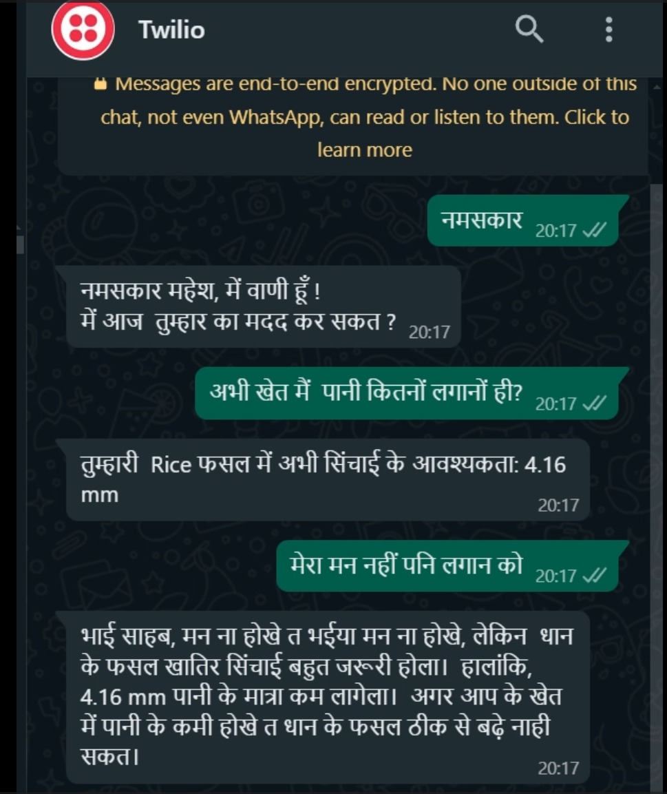
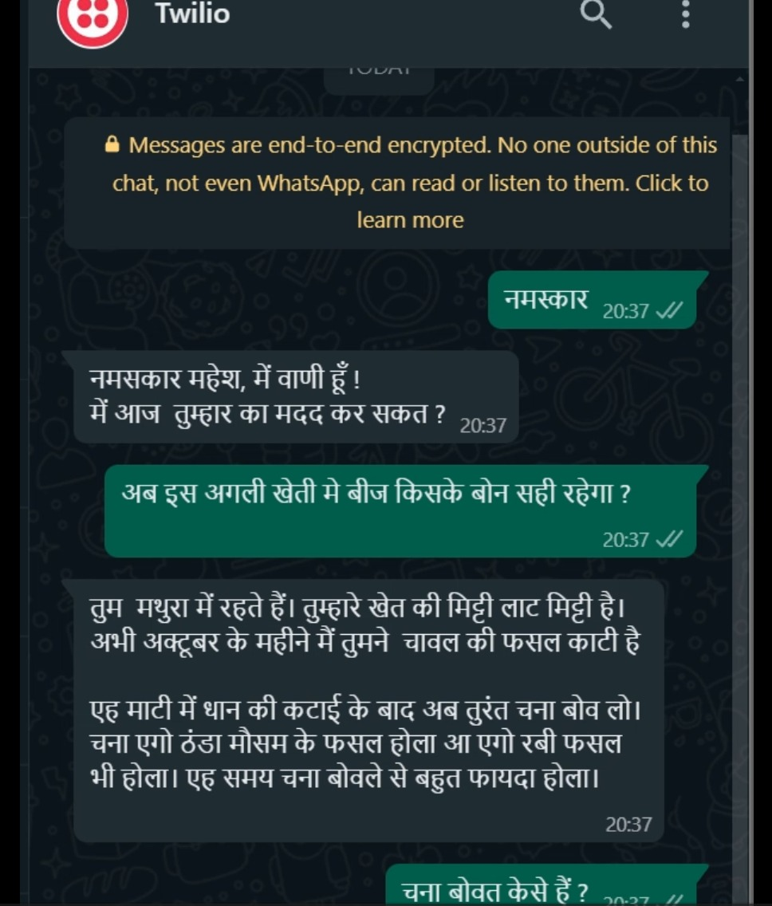

# Vaani : 

‘वाणी’ /ˈvɑːni/ (translation: voice) is a WhatsApp bot designed specifically for farmers.. This conversational bot, powered by Earth Observation data, listens and responds in a regional language with actionable insights, keeping decision-making firmly in the farmer’s hands - much like talking to a trusted friend. 


## How to Use

- Go to the link ```link```
- Join the channel
- Chat with Vaani and get answers to your questions!

## Tech Stack

**Client:** WhatsApp

**Server:** Python Flask


## Getting Started

### Prerequisites

Before you begin, ensure you have the following:

- Python 3.x installed on your machine.
- A Twilio account with WhatsApp API access.
- Ngrok (for local development) or an EC2 instance (for production).

## Run Locally

Clone the project

```bash
  git clone https://github.com/krishnajalan/Vaani
```

Go to the project directory

```bash
  cd Vaani
```

Install dependencies

```bash
  pip install -r requirements.txt
```

Run the app

```bash
  python app.py
```

Expose your local server (if using Ngrok):
```bash
  ngrok http 5000
```
Copy the Ngrok URL and set it as the webhook URL in your Twilio console.


## Screenshots



